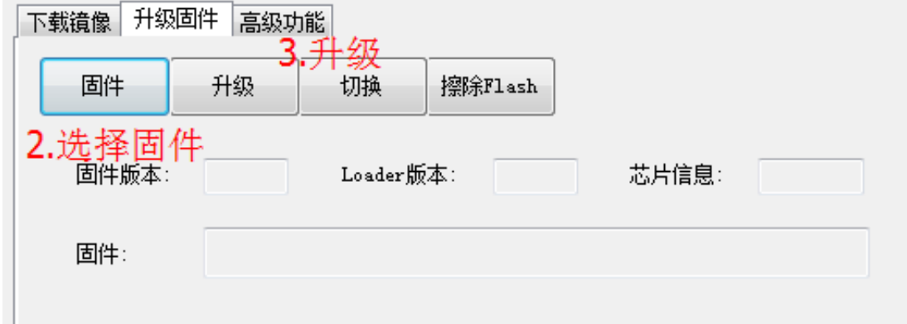
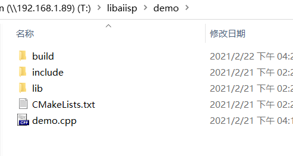
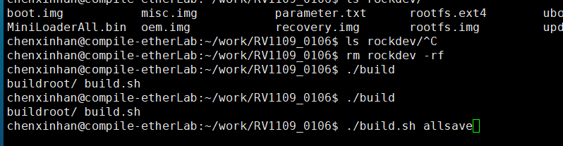
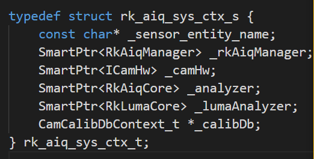

# 第一章.CMake学习笔记

## 1.CMake学习路径，

[网站路径](https://www.jetbrains.com/help/clion/quick-cmake-tutorial.html#new-project)

头文件只包含文件，不包含文件夹；

库文件只包含文件，不包含文件夹。

CMake . :编译当前目录文件

CMake ./：编译当前目录文件

CMake ../：编译上一层目录

CMake ../../：上一层的上一层

## 2.Ctrl + c用于demo终止

static void sigterm_handler(int sig) {

 fprintf(stderr, "signal %d\n", sig);

 quit = true;

}

## 3.link_libraries 和 target_link_libraries 区别

在cmake语法中，link_libraries和target_link_libraries是很重要的两个链接库的方式，虽然写法上很相似，但是功能上有很大区别：

1，link_libraries用在add_executable之前，target_link_libraries用在add_executable之后

2，link_libraries用来链接静态库，target_link_libraries用来链接导入库，即按照header file + .lib + .dll方式隐式调用动态库的.lib库

链接静态库

\`#set lib dir(公共用的静态链接库)`

`link_directories(./libs/${PLATFORM})`

生成动态链接库

\`#generate shared lib`

`add_library(aiisp SHARED ${DIR_SRCS})`

`target_link_libraries(aiisp` 

 `"-Wl,--whole-archive"`

 `rkaiq`

 `"-Wl,--no-whole-archive")`

**在CMakeLists.txt中链接的静态链接库是为了生成的动态链接库或者生成可执行程序服务的。**

## 4.find_package使用

find_package(Threads REQUIRED)

linux的很多库在一个地方可以找到，但是线程库存放在多个地方，需要使用find_package。

# 第二章 代码

## 1.ISP版本

`/* 媒体库版本定义宏 */`
`#ifndef     MODULE_NAME`
`#define     MODULE_NAME         "libaiisp.so"`
`#endif`

`#ifndef     MODULE_VERSION`
`#define     MODULE_VERSION      "1.4.0"`
`#endif`

`#ifndef     HW_PLATFORM`
`#define     HW_PLATFORM         "RK_RV1109"`
`#endif`

`void isp_printf_isp_version(void)`
`{`
    `printf("\n\n\033[40;33m******************************************************************\n");`
    `printf("rk plat info:%s,lib name:%s,isp version:%s,date:%s,time:%s\n",`
        `HW_PLATFORM, MODULE_NAME, MODULE_VERSION,__DATE__,__TIME__);`
    `printf("\n\n\033[40;33m******************************************************************\n");`

    return ;

`}`

## 2.USB线升级

首先进行下图：

若切换不到loader模式，同时按住设备上面RESET，ADKESY这两个按键，按3s，先松开ADKEY键，即可进入loader模式。

选择固件版本进行升级：

## 2.1 repo sync作用：同步174最新代码

<<<<<<< HEAD
## 2.2使用的include库和依赖的.so需要最新的

## 2.3MIPI接线

MIPI进行数据传输时, 若传入的数据不对,解析时会报错,数据间的通信问题.

## 2.4
=======
## 2.2build

mkdir生成build文件夹，删除其它MakeCache等文件，只保留以下文件：

终端纳入build路径，输入cmake .. , make即可，上传到服务器上面不要将build里面的内容上传。

## 2.3编译kernel

勾陈 2-22 上午09:38:02
arch/arm/boot/dts/rv1109-evb-ddr3-v12-facial-gate.dts

勾陈 2-22 上午09:39:01
 ./build.sh kernel

./build.sh uboot

若编译后的时间没有变，编译不成功，则执行一下命令：

rm  rockdev  -rf

./build.sh allsave

勾陈 2-22 上午09:39:14
rockdev/boot.img

rkisp_demo_rk --device /dev/video31 --width 1920 --height 1080 --rkaiq --hdr 2 --stream-skip=10 --stream-count=1 --stream-to=/data/sc2310_hdr2.yuv

添加IP:

ifconfig eth0 192.168.76.106 netmask 255.255.255.0 up
ip route add via 192.168.76.1 dev eth0  metric 100 

/oem/etc/iqfiles/sc2310xxx.xml

## 2.4添加镜头型号

在arch/arm/boot/dts/rv1109-evb-ddr3-v12-facial-gate.dts中添加

I2C占用，释放掉

设备节点被占用，节点与硬件资源挂钩

## 2.5搜索命令

ls -l |grep XXX

## 2.6rk_aiq_sys_ctx_s结构体

## 2.7分辨率裁剪

* the input height of the isp needs to be 8 aligned.
 * Can be cropped to standard resolution by this function,
 * otherwise it will crop out strange resolution according
 * to the alignment rules.
 */

static int imx307_get_selection(struct v4l2_subdev *sd,
				struct v4l2_subdev_pad_config *cfg,
				struct v4l2_subdev_selection *sel)
{
	struct imx307 *imx307 = to_imx307(sd);

	if (sel->target == V4L2_SEL_TGT_CROP_BOUNDS) {
		sel->r.left = CROP_START(imx307->cur_mode->width, DST_WIDTH);
		sel->r.width = DST_WIDTH;
		if (imx307->bus_cfg.bus_type == 3) {
			if (imx307->cur_mode->hdr_mode == NO_HDR)
				sel->r.top = 21;
			else
				sel->r.top = 13;
		} else {
			sel->r.top = CROP_START(imx307->cur_mode->height, DST_HEIGHT);
		}
		sel->r.height = DST_HEIGHT;
		return 0;
	}
	return -EINVAL;
}

## 2.8查看版本

strings /oem/usr/lib/librkaiq.so |grep "AIQ v"

